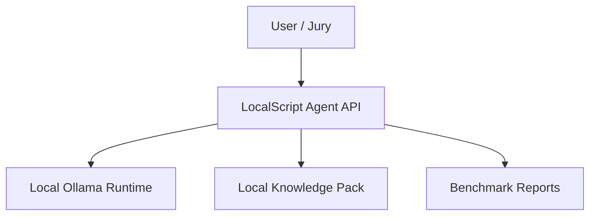
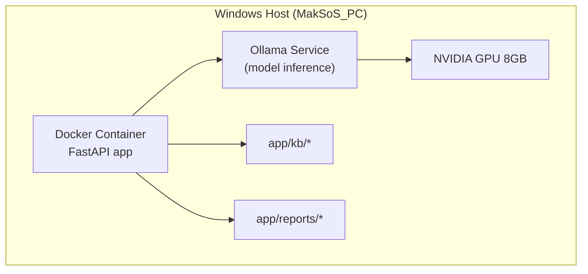
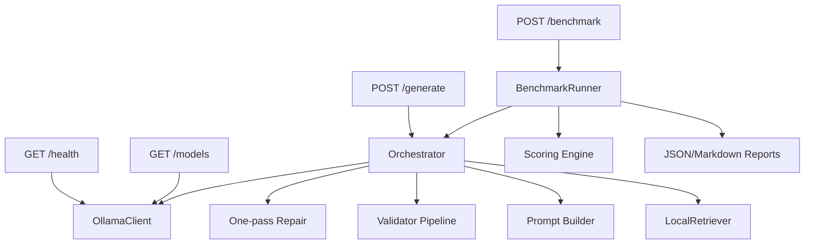

# C4 Architecture

## Level 1 - Context

```mermaid
graph TD
    User["User / Jury"] --> API["LocalScript Agent API"]
    API --> Ollama["Local Ollama Runtime"]
    API --> KB["Local Knowledge Pack"]
    API --> Reports["Benchmark Reports"]
```

## Level 2 - Container

```mermaid
graph TD
    subgraph Host["Windows Host (MakSoS_PC)"]
      Ollama["Ollama Service\n(model inference)"]
      GPU["NVIDIA GPU 8GB"]
      APIContainer["Docker Container\nFastAPI app"]
      KB["app/kb/*"]
      Reports["app/reports/*"]
    end

    APIContainer --> Ollama
    Ollama --> GPU
    APIContainer --> KB
    APIContainer --> Reports
```

## Level 3 - Component (API container)

```mermaid
graph TD
    RouteGenerate["POST /generate"] --> Orchestrator
    RouteBenchmark["POST /benchmark"] --> BenchmarkRunner
    RouteHealth["GET /health"] --> OllamaClient
    RouteModels["GET /models"] --> OllamaClient

    Orchestrator --> Retriever["LocalRetriever"]
    Orchestrator --> Prompts["Prompt Builder"]
    Orchestrator --> OllamaClient
    Orchestrator --> Validators["Validator Pipeline"]
    Orchestrator --> Repair["One-pass Repair"]

    BenchmarkRunner --> Orchestrator
    BenchmarkRunner --> Scoring["Scoring Engine"]
    BenchmarkRunner --> Reports["JSON/Markdown Reports"]
```
